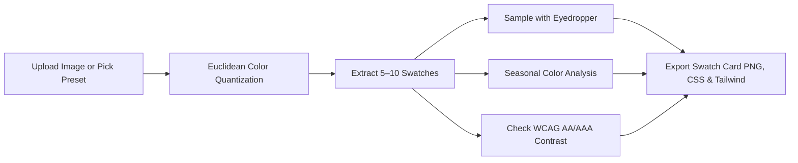

## Color Palette Generator & Image Color Extractor Overview

Extracting harmonized color schemes from photographs, branding moodboards, fashion selfies, and UI screenshots is essential for graphic designers, web developers, interior decorators, and personal stylists. The **ImageAll Color Palette Generator** (also searched as *color pallete* or *coolers color palette*) is a fast, 100% client-side studio engineered to extract dominant hex codes from photos, perform **personal seasonal color analysis**, test WCAG accessibility contrast, and generate exportable CSS, Tailwind, and presentation cards with zero server uploads.

Whether you need a rich **autumn color palette**, a vibrant **blue color palette**, a **soft summer** aesthetic, or a **random color palette generator** like Coolors and Canva, our on-device engine delivers instantaneous, unwatermarked results.

---

### Direct Answer: Best Free Color Palette Generator from Image

> **Direct Answer (AEO / GEO Summary):**
> The best free online color palette generator extracts 5 to 10 dominant colors from any JPG, PNG, or WebP photo directly inside the browser using HTML5 Canvas pixel quantization. It provides instant Hex, RGB, and HSL codes, an interactive eyedropper, seasonal color analysis (Autumn, Winter, Spring, Summer), WCAG AA/AAA accessibility contrast auditing, and one-click export to CSS variables, Tailwind CSS, JSON, and high-resolution presentation swatch card PNGs without signups, subscriptions, or cloud uploads.

---

## 4-Season Color Analysis Matrix: Discover Your Archetype

Seasonal color analysis categorizes personal skin undertones, hair tones, and wardrobe palettes into four macro seasons—further divided into twelve distinct sub-seasons. Use the table below to identify your seasonal palette or test your selfie using our real-time analyzer:

| Season Archetype | Core Undertone | Primary Characteristics | Signature Hex Color Palette | Ideal Queries & Occasions |
| :--- | :--- | :--- | :--- | :--- |
| **True / Warm Autumn** | Warm, Golden, Rich | Earthy, spicy, organic, warm foliage | `#c2410c` (Terracotta), `#d97706` (Amber), `#78350f` (Cedar), `#431407` (Espresso) | `autumn color palette`, `fall color palette`, `warm color palette` |
| **Soft Autumn** | Warm-Neutral, Muted | Low contrast, dusty, blended with warm grey | `#b47359` (Clay), `#d6a289` (Peach Sand), `#9e7777` (Muted Rose), `#848c7f` (Sage) | `soft autumn color palette`, `muted autumn`, `soft autumn celebrities` |
| **Deep / Dark Autumn** | Deep Warm, Saturated | High depth, spiced rust, espresso, burnished copper | `#7c2d12` (Rust), `#451a03` (Dark Cocoa), `#991b1b` (Maroon), `#854d0e` (Mustard) | `deep autumn color palette`, `dark autumn`, `what color palette am i` |
| **Deep Winter** | Cool, High Contrast | Vivid depth, icy contrast, obsidian, royal jewel | `#0f172a` (Midnight Slate), `#4c1d95` (Deep Violet), `#0284c7` (Royal Cobalt), `#881337` (Berry) | `deep winter color palette`, `dark color palette`, `winter color palette` |
| **Cool / True Winter** | Cool, Frosty, Pure | Zero warmth, striking clarity, snow white, fuchsia | `#ffffff` (Pure White), `#1e293b` (Obsidian), `#2563eb` (True Blue), `#db2777` (Vivid Magenta) | `cool winter color palette`, `bright winter`, `skin color palette` |
| **Bright Winter** | Cool-Neutral, Radiant | Electrifying brightness, neon jewel tones | `#06b6d4` (Electric Cyan), `#4f46e5` (Indigo), `#f43f5e` (Rose), `#059669` (Emerald) | `bright winter color palette`, `jewel tones color palette` |
| **Soft Summer** | Cool-Neutral, Smoky | Powdery, delicate, lavender mist, slate | `#94a3b8` (Slate), `#c084fc` (Soft Lilac), `#f472b6` (Rose Dusk), `#93c5fd` (Sky Mist) | `soft summer color palette`, `summer color palette`, `pastel color palette` |
| **Light Summer** | Cool, Airy, Delicate | Soft pastel illumination, seafoam, periwinkle | `#e2e8f0` (Frost), `#a5b4fc` (Periwinkle), `#bae6fd` (Ice Blue), `#fed7aa` (Soft Cream) | `light summer color palette`, `true summer`, `cream color palette` |
| **Bright Spring** | Warm, Vibrant, Clear | High saturation, sunny coral, lemon zest, mint | `#f43f5e` (Watermelon), `#fb923c` (Tangerine), `#facc15` (Sunny Gold), `#4ade80` (Spring Green) | `bright spring color palette`, `true spring`, `bright color palette` |
| **Warm / True Spring** | Warm, Fresh, Golden | Radiant peach, daffodil yellow, warm turquoise | `#f97316` (Warm Coral), `#eab308` (Goldenrod), `#06b6d4` (Turquoise), `#84cc16` (Lime) | `spring color palette`, `warm color palette`, `yellow color palette` |

---

## Trending Seasonal & Aesthetic Palettes

### 1. Autumn & Fall Palettes (`autumn color palette`, `fall color palette`)
Autumn palettes capture the natural transformation of September and October landscapes. They balance burnt terracotta, maple red, toasted pumpkin orange, and deep moss green. Designers use these palettes to evoke warmth, comfort, coziness, and heritage authenticity.

- **September Color Palette**: A warm transitional palette blending the golden glow of late summer (`#eab308`) with crisp russet leaves (`#c2410c`) and orchard green (`#166534`).
- **August Color Palette**: Sun-drenched wheat (`#fef08a`), terracotta brick (`#ea580c`), dusty blush (`#fda4af`), and sage meadow (`#848c7f`).
- **Halloween Color Palette**: High-contrast festive drama pairing vibrant pumpkin orange (`#ea580c`), witch amethyst (`#581c87`), spectral black (`#111827`), and eerie slime green (`#84cc16`).

### 2. Cool Blue & Teal Palettes (`blue color palette`, `teal color palette`)
Blue palettes inspire trust, tranquility, and enterprise authority. From deep oceanic navy (`#0c4a6e`) to vibrant cyan (`#06b6d4`) and ice blue (`#bae6fd`), monochromatic and complementary blue palettes are the #1 choice for technology brands, fintech portals, and modern web UI design.

### 3. Nature & Shades of Green (`shades of green color palette`, `olive green`)
Shades of green represent vitality, wellness, environmental sustainability, and renewal. Our green palette features deep pine (`#14532d`), forest emerald (`#15803d`), spring mint (`#22c55e`), and earthy **olive green** (`#65a30d`), creating harmonious gradients for organic and lifestyle brands.

### 4. Jewel Tones (`jewel tones color palette`)
Inspired by precious gemstones—sapphire blue (`#0c4a6e`), ruby red (`#831843`), emerald green (`#14532d`), and imperial amethyst (`#581c87`)—jewel tone palettes provide deep saturation, dramatic editorial sophistication, and luxury brand prestige.

### 5. Viridis Scientific Palette (`viridis color palette`)
Viridis is the gold standard for data visualization, heatmap analytics, and scientific dashboards. Spanning from deep violet (`#440154`) through ocean blue (`#277f8e`) to luminous yellow-green (`#4ac16d`), Viridis is mathematically perceptually uniform and readable for people with color vision deficiencies.

---

## Technical Comparison: ImageAll Studio vs. Cloud Alternatives

| Feature Spec | Coolors (Free Tier) | Canva Color Tool | ImageAll In-Browser Studio |
| :--- | :--- | :--- | :--- |
| **Pricing & Limits** | Ad-heavy, paid pro limits | Requires account & Canva login | **100% Free Forever, Unlimited** |
| **Cloud Uploads** | Yes (transmits image data) | Yes (stores on cloud storage) | **Zero (100% Local On-Device)** |
| **Seasonal Color Analysis** | Not available | Not available | **Automated Warmth & Contrast Engine** |
| **Palette Swatch Card PNG** | Requires export flow / watermark | Requires manual canvas layout | **1-Click 1200×630 Presentation PNG** |
| **WCAG Contrast Checker** | Basic / separate page | None | **Live AA / AAA Interactive Ratio** |
| **Tailwind & CSS Code Export** | Limited | None | **Instant 1-Click Code Generation** |
| **Eyedropper Sampling** | Browser API limited | Basic | **Direct Canvas Pixel Sampling** |

---

## Step-by-Step Guide: How to Generate & Export Color Palettes



1. **Upload Photo or Choose a Preset**: Drag and drop any image into the workspace, or click presets like *Autumn / Fall*, *Deep Winter*, *Shades of Green*, or *Randomize (Coolors Style)*.
2. **Select Swatch Count & Format**: Choose between 5, 6, 8, or 10 swatches. Toggle color formats between HEX (`#RRGGBB`), RGB (`rgb(r, g, b)`), or HSL (`hsl(h, s%, l%)`).
3. **Sample with Live Eyedropper**: Click anywhere on the image preview to sample custom pixel colors and add them directly into your active palette.
4. **Inspect Seasonal Analysis & WCAG Contrast**: Review your detected seasonal archetype. Click any two swatches to verify whether your color combination satisfies WCAG AA (4.5:1) or AAA (7.0:1) contrast ratios.
5. **Export & Share**: Click the copy buttons to grab all Hex codes, CSS `:root` variables, or Tailwind CSS config. Click **Download** to save a 1200×630 presentation card graphic!

---

## Developer Code Export Examples

### CSS Custom Properties (`:root` Variables)
```css
:root {
  --color-primary: #c2410c;    /* Terracotta Flame */
  --color-secondary: #ea580c;  /* Warm Tangerine */
  --color-accent: #d97706;     /* Amber Gold */
  --color-highlight: #ca8a04;  /* Golden Harvest */
  --color-surface: #78350f;    /* Cedar Bark */
  --color-dark: #431407;       /* Espresso Shadow */
}
```

### Tailwind CSS (`tailwind.config.js`)
```javascript
module.exports = {
  theme: {
    extend: {
      colors: {
        palette: {
          50: '#fef3c7',
          100: '#ca8a04',
          200: '#d97706',
          300: '#ea580c',
          400: '#c2410c',
          500: '#78350f',
          900: '#431407',
        }
      }
    }
  }
};
```

---

## Frequently Asked Questions (FAQ)

### 1. How do I extract a color palette from an image or photo?
Drag and drop your picture into the interactive tool above. The algorithm reads raw image data from an HTML5 Canvas element, clusters similar color values using Euclidean color-distance sampling, and outputs the top 5 to 10 most prominent colors in Hex, RGB, and HSL formats.

### 2. What color palette am I? How does seasonal color analysis work?
Personal color analysis assesses your natural undertones (warm golden vs. cool blue) and value contrast. By uploading a portrait or selfie in natural lighting, our analyzer measures the average warmth `(Red - Blue)` and relative luminance of your skin and hair pixels, matching you to seasonal categories like True Autumn, Deep Winter, Bright Spring, or Soft Summer.

### 3. What is the difference between Soft Autumn, Deep Autumn, and True Autumn?
- **True Autumn**: Rich, balanced warm undertones featuring terracotta, pumpkin amber, and warm olive.
- **Soft Autumn**: Muted, low-contrast earthy tones blended with neutral grey, clay, and taupe.
- **Deep Autumn**: High-contrast, dark warm tones with rich espresso, chocolate brown, burnt orange, and maroon.

### 4. What defines a Deep Winter vs. Cool Winter color palette?
Deep Winter blends dark value with cool saturation—featuring jet black, royal cobalt, iced berry, and deep ruby. Cool Winter is purely icy and cool, characterized by arctic blues, frosty silvers, clean whites, and electric fuchsia with zero warm undertones.

### 5. Can I generate a random color palette like Coolors or Canva?
Yes. Click the **🎲 Randomize (Coolors Style)** button to instantly generate fresh, harmonious palettes based on complementary and analogous HSL hue stepping without needing third-party tools or accounts.

### 6. How do I copy Hex codes, CSS variables, or Tailwind CSS configuration?
Click any individual swatch to copy its formatted code. To export the full palette at once, click **Copy All Hex Codes**, **Copy CSS Variables**, **Copy Tailwind Config**, or **Copy JSON** located directly below the swatches.

### 7. How does the built-in WCAG accessibility contrast tester work?
Select any two swatches from your palette. The tool evaluates the relative luminance of both colors using the standard W3C formula: `(L1 + 0.05) / (L2 + 0.05)`. It outputs the exact contrast ratio and confirms whether your text pairing passes WCAG AA (4.5:1 for normal text) or WCAG AAA (7.0:1 for enhanced accessibility).

### 8. Can I sample custom colors from specific areas of my photo using an eyedropper?
Yes! Click directly on your image preview. The canvas eyedropper reads the exact pixel under your cursor and adds that color directly into your active palette list.

### 9. What makes a September, August, or Halloween fall color palette?
- **September Palette**: Transition from warm golden harvest (`#facc15`) to burnt terracotta (`#c2410c`) and rustic cedar (`#78350f`).
- **August Palette**: Sunlit ochre, dry wheat, peach sunset, and muted sage.
- **Halloween Palette**: Saturated pumpkin orange (`#ea580c`), mystical purple (`#581c87`), obsidian black (`#111827`), and glowing bone white (`#fef08a`).

### 10. What is a Viridis color palette and why is it popular in data visualization?
Viridis is a mathematically crafted color progression ranging from dark purple through teal to bright yellow. Because its perceptual luminance increases monotonically, charts rendered in Viridis can be interpreted accurately even by viewers with color vision deficiency or when printed in grayscale.

### 11. Can I download a color palette presentation swatch card?
Yes. Click the **Download** button to export a high-definition 1200×630 presentation card PNG complete with image thumbnail, color swatches, Hex and RGB values, and seasonal analysis archetype—ready to share in Figma, Canva, or client style proposals.

### 12. Are my uploaded photos or skin selfies uploaded to any external server?
Never. All processing occurs locally within your web browser using HTML5 Canvas and client-side JavaScript. Your files are never transmitted across the network, stored in databases, or used for AI training.
